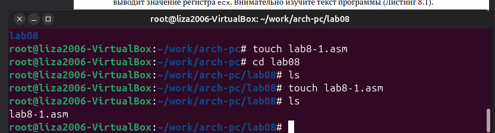
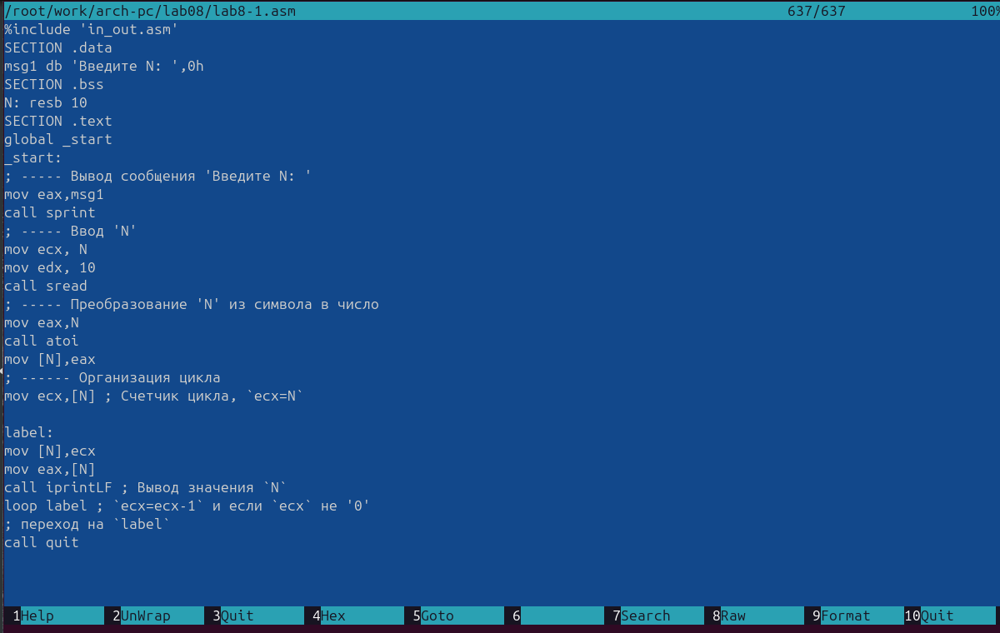

---
## Front matter
title: "Отчёт по лабораторной работе №8"
subtitle: "Простейший вариант"
author: "Волчкова Eлизавета Дмитриевна"

## Generic otions
lang: ru-RU
toc-title: "Содержание"

## Bibliography
bibliography: bib/cite.bib
csl: pandoc/csl/gost-r-7-0-5-2008-numeric.csl

## Pdf output format
toc: true # Table of contents
toc-depth: 2
lof: true # List of figures
lot: true # List of tables
fontsize: 12pt
linestretch: 1.5
papersize: a4
documentclass: scrreprt
## I18n polyglossia
polyglossia-lang:
  name: russian

polyglossia-otherlangs:
  name: english
## I18n babel
babel-lang: russian
babel-otherlangs: english
## Fonts
mainfont: IBM Plex Serif
romanfont: IBM Plex Serif
sansfont: IBM Plex Sans
monofont: IBM Plex Mono
mathfont: STIX Two Math
mainfontoptions: Ligatures=Common,Ligatures=TeX,Scale=0.94
romanfontoptions: Ligatures=Common,Ligatures=TeX,Scale=0.94
sansfontoptions: Ligatures=Common,Ligatures=TeX,Scale=MatchLowercase,Scale=0.94
monofontoptions: Scale=MatchLowercase,Scale=0.94,FakeStretch=0.9
mathfontoptions:
## Biblatex
biblatex: true
biblio-style: "gost-numeric"
biblatexoptions:
  - parentracker=true
  - backend=biber
  - hyperref=auto
  - language=auto
  - autolang=other*
  - citestyle=gost-numeric
## Pandoc-crossref LaTeX customization
figureTitle: "Рис."
tableTitle: "Таблица"
listingTitle: "Листинг"
lofTitle: "Список иллюстраций"
lotTitle: "Список таблиц"
lolTitle: "Листинги"
## Misc options
indent: true
header-includes:
  - \usepackage{indentfirst}
  - \usepackage{float} # keep figures where there are in the text
  - \floatplacement{figure}{H} # keep figures where there are in the text
---

# Цель работы

Приобретение навыков написания программ с использованием циклов и обработкой
аргументов командной строки.

# Задание

Напишите программу, которая находит сумму значений функции 𝑓(𝑥) для
𝑥 = 𝑥1, 𝑥2, ..., 𝑥𝑛, т.е. программа должна выводить значение 𝑓(𝑥1) + 𝑓(𝑥2) + ... + 𝑓(𝑥𝑛).
Значения 𝑥𝑖 передаются как аргументы. Вид функции 𝑓(𝑥) выбрать из таблицы
8.1 вариантов заданий в соответствии с вариантом, полученным при выполнении
лабораторной работы № 7. Создайте исполняемый файл и проверьте его работу на
нескольких наборах 𝑥 = 𝑥1, 𝑥2, ..., 𝑥𝑛.

# Выполнение лабораторной работы

Описываются проведённые действия, в качестве иллюстрации даётся ссылка на иллюстрацию

Ввела файл lab8-1.asm текст программы из листинга 8.1. Затем создала исполняемый файл
и проверила его работу.

Данный пример показывает, что использование регистра ecx в теле цилка loop может
привести к некорректной работе программы.
Далее я изменила текст программы добавив изменение
значение регистра ecx в цикле.

Потом создала исполняемый файл и проверилаего работу. 
В качестве примера рассмотрела программу, которая
выводит значение регистра ecx. 
Внимательно изучила текст программы
.
Создайла  исполняемый файл и проверила его работу. Регистр ecx принимает значение, равное 
значению 𝑁, введенному с клавиатуры.

После внесла  изменения в текст программы, добавив команды push
и pop (добавления в стек и извлечения из стека) для сохранения значения счетчика цикла
loop.
Создала исполняемый файл и проверила его работу. 
Соответствует ли в данном случае
число проходов цикла значению 𝑁 введенному с клавиатуры? - нет! Циклов было больше 100.

Далее создала файл lab8-2.asm в каталоге ~/work/arch-pc/lab08 и ввела в него текст про-
граммы из листинга 8.2.
Потом создала исполняемый файл и запустилаего, указав аргументы:
Ckолько аргументов было обработано программой?-

Затем создала файл lab8-3.asm в каталоге ~/work/arch-pc/lab08, ввела в него текст программы из листинга 8.3.

Я создала исполняемый файл и запустила его, указав аргументы. 

	Написала программу, которая находит сумму значений функции 𝑓(𝑥) для
𝑥 = 𝑥1, 𝑥2, ..., 𝑥𝑛, т.е. программа должна выводить значение 𝑓(𝑥1) + 𝑓(𝑥2) + ... + 𝑓(𝑥𝑛).
Значения 𝑥𝑖 передаются как аргументы. 
	Вид функции 𝑓(𝑥) выбрала из таблицы 8.1 вариантов заданий в соответствии с вариантом, полученным при выполнении лабораторной работы № 7 и создалв исполняемый файл и проверилпа его работу на
нескольких наборах 𝑥 = 𝑥1, 𝑥2, ..., 𝑥𝑛

# Выводы
	Целью работы было приобретение навыков написания программ с использованием циклов и обработкой
аргументов командной строки, проделав данные задания я усвоила материал, имею представления о том, как правильно использовать циклы и командные строки.

# Список литературы{.unnumbered}
	1. GDB: The GNU Project Debugger. — URL: https://www.gnu.org/software/gdb/.
	2. GNU Bash Manual. — 2016. — URL: https://www.gnu.org/software/bash/manual/.
	3. Midnight Commander Development Center. — 2021. — URL: https://midnight-commander.
org/.
	4. NASM Assembly Language Tutorials. — 2021. — URL: https://asmtutor.com/.
	5. Newham C. Learning the bash Shell: Unix Shell Programming. — O’Reilly Media, 2005. —
354 с. — (In a Nutshell). — ISBN 0596009658. — URL: http://www.amazon.com/Learning-
bash-Shell-Programming-Nutshell/dp/0596009658.
	6. Robbins A. Bash Pocket Reference. — O’Reilly Media, 2016. — 156 с. — ISBN 978-1491941591.
	7. The NASM documentation. — 2021. — URL: https://www.nasm.us/docs.php.
	8. Zarrelli G. Mastering Bash. — Packt Publishing, 2017. — 502 с. — ISBN 9781784396879.
	9. Колдаев В. Д., Лупин С. А. Архитектура ЭВМ. — М. : Форум, 2018.
	10. Куляс О. Л., Никитин К. А. Курс программирования на ASSEMBLER. — М. : Солон-Пресс,
2017.
	11. Новожилов О. П. Архитектура ЭВМ и систем. — М. : Юрайт, 2016.
	12. Расширенный ассемблер: NASM. — 2021. — URL: https://www.opennet.ru/docs/RUS/nasm/.
	13. Робачевский А., Немнюгин С., Стесик О. Операционная система UNIX. — 2-е изд. — БХВ-
Петербург, 2010. — 656 с. — ISBN 978-5-94157-538-1.
	14. Столяров А. Программирование на языке ассемблера NASM для ОС Unix. — 2-е изд. —
М. : МАКС Пресс, 2011. — URL: http://www.stolyarov.info/books/asm_unix.
	15. Таненбаум Э. Архитектура компьютера. — 6-е изд. — СПб. : Питер, 2013. — 874 с. —
(Классика Computer Science).
	16. Таненбаум Э., Бос Х. Современные операционные системы. — 4-е изд. — СПб. : Питер,
2015. — 1120 с. — (Классика Computer Science).
::: {#refs}
:::
