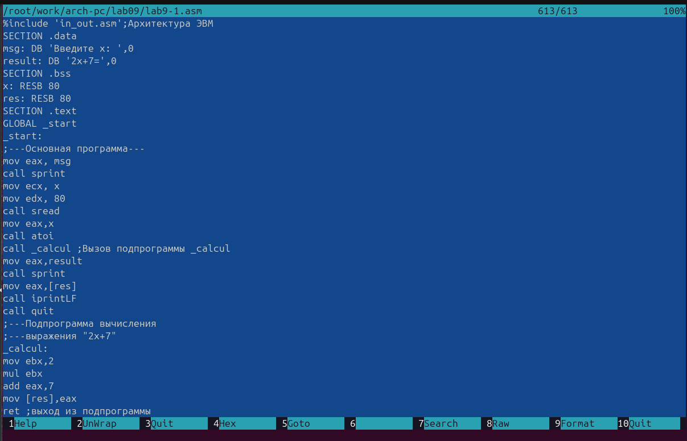

---
## Front matter
title: "Шаблон отчёта по лабораторной работе номер 9"
subtitle: "Простейший вариант"
author: "Волчкова Елизавета Дмитриевна"

## Generic otions
lang: ru-RU
toc-title: "Содержание"

## Bibliography
bibliography: bib/cite.bib
csl: pandoc/csl/gost-r-7-0-5-2008-numeric.csl

## Pdf output format
toc: true # Table of contents
toc-depth: 2
lof: true # List of figures
lot: true # List of tables
fontsize: 12pt
linestretch: 1.5
papersize: a4
documentclass: scrreprt
## I18n polyglossia
polyglossia-lang:
  name: russian
  options:
	- spelling=modern
	- babelshorthands=true
polyglossia-otherlangs:
  name: english
## I18n babel
babel-lang: russian
babel-otherlangs: english
## Fonts
mainfont: IBM Plex Serif
romanfont: IBM Plex Serif
sansfont: IBM Plex Sans
monofont: IBM Plex Mono
mathfont: STIX Two Math
mainfontoptions: Ligatures=Common,Ligatures=TeX,Scale=0.94
romanfontoptions: Ligatures=Common,Ligatures=TeX,Scale=0.94
sansfontoptions: Ligatures=Common,Ligatures=TeX,Scale=MatchLowercase,Scale=0.94
monofontoptions: Scale=MatchLowercase,Scale=0.94,FakeStretch=0.9
mathfontoptions:
## Biblatex
biblatex: true
biblio-style: "gost-numeric"
biblatexoptions:
  - parentracker=true
  - backend=biber
  - hyperref=auto
  - language=auto
  - autolang=other*
  - citestyle=gost-numeric
## Pandoc-crossref LaTeX customization
figureTitle: "Рис."
tableTitle: "Таблица"
listingTitle: "Листинг"
lofTitle: "Список иллюстраций"
lotTitle: "Список таблиц"
lolTitle: "Листинги"
## Misc options
indent: true
header-includes:
  - \usepackage{indentfirst}
  - \usepackage{float} # keep figures where there are in the text
  - \floatplacement{figure}{H} # keep figures where there are in the text
---

# Цель работы

Приобретение навыков написания программ с использованием подпрограмм и знакомство
с методами отладки при помощи GDB и его основными возможностями.

# Задание

1. Преобразуйте программу из лабораторной работы №8 (Задание №1 для самостоятель-
ной работы), реализовав вычисление значения функции 𝑓(𝑥) как подпрограмму.
2. В листинге 9.3 приведена программа вычисления выражения (3 + 2) ∗ 4 + 5. При запуске
данная программа дает неверный результат. Проверьте это. С помощью отладчика GDB,
анализируя изменения значений регистров, определите ошибку и исправьте ее

# Теоретическое введение

Отладка — это процесс поиска и исправления ошибок в программе. В общем случае его
можно разделить на четыре этапа:
• обнаружение ошибки;
• поиск её местонахождения;
• определение причины ошибки;
• исправление ошибки.
Можно выделить следующие типы ошибок:
• синтаксические ошибки — обнаруживаются во время трансляции исходного кода и
вызваны нарушением ожидаемой формы или структуры языка;
• семантические ошибки — являются логическими и приводят к тому, что программа
запускается, отрабатывает, но не даёт желаемого результата;
• ошибки в процессе выполнения — не обнаруживаются при трансляции и вызывают пре-
рывание выполнения программы (например, это ошибки, связанные с переполнением
или делением на ноль).
Более подробно про Unix см. в [@tanenbaum_book_modern-os_ru; @robbins_book_bash_en; @zarrelli_book_mastering-bash_en; @newham_book_learning-bash_en].

# Выполнение лабораторной работы

1. Создала каталог для выполнения лабораторной работы № 9, перешла в него и со-
здала файл lab09-1.asm

3. В качестве примера рассмотрела программу вычисления арифметического выражения
𝑓(𝑥) = 2𝑥 + 7 с помощью подпрограммы _calcul. В данном примере 𝑥 вводилось с
клавиатуры, а само выражение вычисляется в подпрограмме. Затем внимательно изучила
текст программы (Листинг 9.1).
Листинг 9.1. П

Первые строки программы отвечают за вывод сообщения на экран (call sprint), чтение
данных введенных с клавиатуры (call sread) и преобразования введенных данных из
символьного вида в численный (call atoi).]
После следующей инструкции call _calcul, которая передает управление подпрограмме
_calcul, выполнила инструкции подпрограммы:

Инструкция ret является последней в подпрограмме и ее исполнение приводит к воз-
вращению в основную программу к инструкции, следующей за инструкцией call, которая
вызвала данную подпрограмму.

Последние строки программы реализуют вывод сообщения (call sprint), результата вы-
числения (call iprintLF) и завершение программы (call quit).

Ввела в файл lab09-1.asm текст программы из листинга 9.1. Создала исполняемый
файл и проверила его работу.

Потом изменила текст программы, добавив подпрограмму _subcalcul в подпрограмму _calcul,
для вычисления выражения 𝑓(𝑔(𝑥)), где 𝑥 вводится с клавиатуры, 𝑓(𝑥) = 2𝑥 + 7, 𝑔(𝑥) =
3𝑥 − 1. Т.е. 𝑥 передается в подпрограмму _calcul из нее в подпрограмму _subcalcul, где
вычисляется выражение 𝑔(𝑥), результат возвращается в _calcul и вычисляется выражение
𝑓(𝑔(𝑥)). Результат возвращается в основную программу для вывода результата на экран.
9.4.2. Отладка программам с помощью GDB
Сначала создала файл lab09-2.asm с текстом программы из Листинга 9.2. (Программа печати
сообщения Hello world!):

Получила исполняемый файл. Для работы с GDB в исполняемый файл необходимо добавила
отладочную информацию, для этого трансляцию программ необходимо проводить с ключом
‘-g’.\

Загрузила исполняемый файл в отладчик gdb:
user@dk4n31:~$ gdb lab09-2
Проверила работу программы, запустив ее в оболочке GDB с помощью команды run (со-
кращённо r):
(

Hello, world!
[Inferior 1 (process 10220) exited normally]
(gdb)
Для более подробного анализа программы установила брейкпоинт на метку _start, с
которой начинается выполнение любой ассемблерной программы, и запустила её.
(gdb) break _start
Breakpoint 1 at 0x8049000: file lab09-2.asm, line 12.
(gdb) run
Starting program: ~/work/arch-pc/lab09/lab09-2
Breakpoint 1, _start () at lab09-2.asm:12
12 mov eax, 4

Посмотрела дисассимилированный код программы с помощью команды disassemble
начиная с метки _start
(gdb) disassemble _start
Переключилась на отображение команд с Intel’овским синтаксисом, введя команду set
disassembly-flavor intel
(gdb) set disassembly-flavor intel
(gdb) disassemble _start
Перечислила различия отображения синтаксиса машинных команд в режимах ATT и Intel.
Далее включила режим псевдографики для более удобного анализа программы (рис. 9.2):
(gdb) layout asm
(gdb) layout regs

В этом режиме есть три окна:

• В верхней части видны названия регистров и их текущие значения;
• В средней части виден результат дисассимилирования программы;
• Нижняя часть доступна для ввода команд.

9.4.2.1. Добавление точек останова
Установить точку останова можно командой break (кратко b). Типичный аргумент этой
команды — место установки. Его можно задать или как номер строки программы (имеет
смысл, если есть исходный файл, а программа компилировалась с информацией об отладке),
или как имя метки, или как адрес. Чтобы не было путаницы с номерами, перед адресом
ставится «звёздочка»:
На предыдущих шагах была установлена точка останова по имени метки (_start). Про-
верьте это с помощью команды info breakpoints (кратко i b):
Архитектура ЭВМ
(gdb) info breakpoints
Установим еще одну точку останова по адресу инструкции. Адрес инструкции можно
увидеть в средней части экрана в левом столбце соответствующей инструкции (см. рис. 9.3).
Определите адрес предпоследней инструкции (mov ebx,0x0) и установите точку останова.
(gdb) break *<адрес>
Посмотрите информацию о всех установленных точках останова:
(gdb) i b
Архитектура ЭВМ
(gdb) info breakpoints
Установим еще одну точку останова по адресу инструкции. Адрес инструкции можно
увидеть в средней части экрана в левом столбце соответствующей инструкции (см. рис. 9.3).
Определите адрес предпоследней инструкции (mov ebx,0x0) и установите точку останова.
(gdb) break *<адрес>
Посмотрите информацию о всех установленных точках останова:
(gdb) i b
Рис. 9.3. Установка точки останова по адресу инструкции
9.4.2.2. Работа с данными программы в GDB
Отладчик может показывать содержимое ячеек памяти и регистров, а при необходимости
позволяет вручную изменять значения регистров и переменных.
Выполните 5 инструкций с помощью команды stepi (или si) и проследите за изменением
значений регистров. Значения каких регистров изменяются?
Посмотреть содержимое регистров также можно с помощью команды info registers
(или i r).
(gdb) info registers
Для отображения содержимого памяти можно использовать команду x <адрес>, которая
выдаёт содержимое ячейки памяти по указанному адресу. Формат, в котором выводятся
данные, можно задать после имени команды через косую черту: x/NFU <адрес>.
С помощью команды x &<имя переменной> также можно посмотреть содержимое пере-
менной.
Посмотрите значение переменной msg1 по имен
(gdb) x/1sb &msg1
0x804a000 <msg1>: "Hello, "
Посмотрите значение переменной msg2 по адресу. Адрес переменной можно определить
по дизассемблированной инструкции. Посмотрите инструкцию mov ecx,msg2 которая запи-
сывает в регистр ecx адрес перемененной msg2 (рис. 9.4)
Изменить значение для регистра или ячейки памяти можно с помощью команды set,
задав ей в качестве аргумента имя регистра или адрес. При этом перед именем регистра
ставится префикс $, а перед адресом нужно указать в фигурных скобках тип данных (раз-
мер сохраняемого значения; в качестве типа данных можно использовать типы языка Си).
Измените первый символ переменной msg1 (рис. 9.5):
(gdb) set {char}msg1='h'
(gdb) x/1sb &msg1
0x804a000 <msg1>: "hello, "
(gdb)
Замените любой символ во второй переменной msg2.
Чтобы посмотреть значения регистров используется команда print /F <val> (перед име-
нем регистра обязательно ставится префикс $) (рис. 9.6):
p/F $<регистр>
Выведете в различных форматах (в шестнадцатеричном формате, в двоичном формате и
в символьном виде) значение регистра edx.
С помощью команды set измените значение регистра ebx:
(gdb) set $ebx='2'
(gdb) p/s $ebx
$3 = 50
(gdb) set $ebx=2
(gdb) p/s $ebx
$4 = 2
(gdb)
Объясните разницу вывода команд p/s $ebx.
Завершите выполнение программы с помощью команды continue (сокращенно c) или
stepi (сокращенно si) и выйдите из GDB с помощью команды quit (сокращенно q).

9.4.2.3. Обработка аргументов командной строки в GDB
Скопируйте файл lab8-2.asm, созданный при выполнении лабораторной работы №8,
с программой выводящей на экран аргументы командной строки (Листинг 8.2) в файл с
именем lab09-3.asm:
cp ~/work/arch-pc/lab08/lab8-2.asm ~/work/arch-pc/lab09/lab09-3.asm
Создайте исполняемый файл.
nasm -f elf -g -l lab09-3.lst lab09-3.asm
ld -m elf_i386 -o lab09-3 lab09-3.o
Для загрузки в gdb программы с аргументами необходимо использовать ключ --args.
Загрузите исполняемый файл в отладчик, указав аргументы:
gdb --args lab09-3 аргумент1 аргумент 2 'аргумент 3'
Как отмечалось в предыдущей лабораторной работе, при запуске программы аргументы
командной строки загружаются в стек. Исследуем расположение аргументов командной
строки в стеке после запуска программы с помощью gdb.
Для начала установим точку останова перед первой инструкцией в программе и запустим
ее.
(gdb) b _start
(gdb) run
Адрес вершины стека храниться в регистре esp и по этому адресу располагается число
равное количеству аргументов командной строки (включая имя программы):
(gdb) x/x $esp
0xffffd200: 0x05
Как видно, число аргументов равно 5 – это имя программы lab09-3 и непосредственно
аргументы: аргумент1, аргумент, 2 и 'аргумент 3'.

Посмотрите остальные позиции стека – по адесу [esp+4] располагается адрес в памяти
где находиться имя программы, по адесу [esp+8] храниться адрес первого аргумента, по
аресу [esp+12] – второго и т.д.

Объясните, почему шаг изменения адреса равен 4 ([esp+4], [esp+8], [esp+12] и т.д.).

9.5. Задание для самостоятельной работы
1. Преобразуйте программу из лабораторной работы №8 (Задание №1 для самостоятель-
ной работы), реализовав вычисление значения функции 𝑓(𝑥) как подпрограмму.

3. В листинге 9.3 приведена программа вычисления выражения (3 + 2) ∗ 4 + 5. При запуске
данная программа дает неверный результат. Проверьте это. С помощью отладчика GDB,
анализируя изменения значений регистров, определите ошибку и исправьте ее.

{#fig:001 width=70%}   

# Выводы

Целью работы было - приобретение навыков написания программ с использованием подпрограмм и знакомство
с методами отладки при помощи GDB и его основными возможностями, сделав данные задания, я познакомилась с написанием программ при помощи GDB.

# Список литературы{.unnumbered}
1. GDB: The GNU Project Debugger. — URL: https://www.gnu.org/software/gdb/.
2. GNU Bash Manual. — 2016. — URL: https://www.gnu.org/software/bash/manual/.
3. Midnight Commander Development Center. — 2021. — URL: https://midnight-commander.
org/.
4. NASM Assembly Language Tutorials. — 2021. — URL: https://asmtutor.com/.
5. Newham C. Learning the bash Shell: Unix Shell Programming. — O’Reilly Media, 2005. —
354 с. — (In a Nutshell). — ISBN 0596009658. — URL: http://www.amazon.com/Learning-
bash-Shell-Programming-Nutshell/dp/0596009658.
6. Robbins A. Bash Pocket Reference. — O’Reilly Media, 2016. — 156 с. — ISBN 978-1491941591.
7. The NASM documentation. — 2021. — URL: https://www.nasm.us/docs.php.
8. Zarrelli G. Mastering Bash. — Packt Publishing, 2017. — 502 с. — ISBN 9781784396879.
9. Колдаев В. Д., Лупин С. А. Архитектура ЭВМ. — М. : Форум, 2018.
10. Куляс О. Л., Никитин К. А. Курс программирования на ASSEMBLER. — М. : Солон-Пресс,
2017.
11. Новожилов О. П. Архитектура ЭВМ и систем. — М. : Юрайт, 2016.
12. Расширенный ассемблер: NASM. — 2021. — URL: https://www.opennet.ru/docs/RUS/nasm/.
13. Робачевский А., Немнюгин С., Стесик О. Операционная система UNIX. — 2-е изд. — БХВ-
Петербург, 2010. — 656 с. — ISBN 978-5-94157-538-1.
14. Столяров А. Программирование на языке ассемблера NASM для ОС Unix. — 2-е изд. —
М. : МАКС Пресс, 2011. — URL: http://www.stolyarov.info/books/asm_unix.
15. Таненбаум Э. Архитектура компьютера. — 6-е изд. — СПб. : Питер, 2013. — 874 с. —
(Классика Computer Science).
16. Таненбаум Э., Бос Х. Современные операционные системы. — 4-е изд. — СПб. : Питер,
2015. — 1120 с. — (Классика Computer Science)
::: {#refs}
:::
